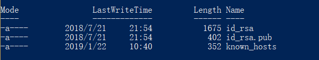
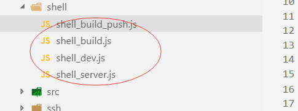
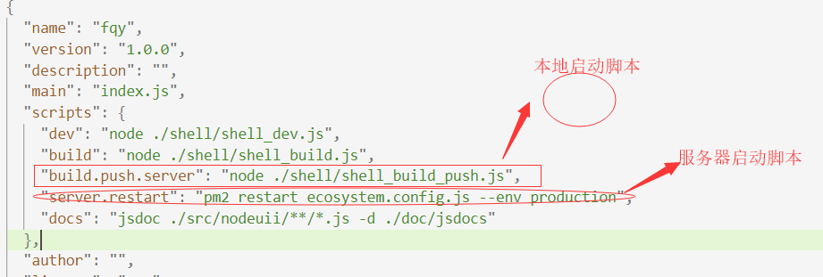

**随着项目的越来越复杂，项目的工程化跟自动化要求也愈加更高，就在闲暇时间里用webpack+shelljs+ssh+pm2 实现本地实现一条命令实现打包+上传服务器+服务器重新启动等一系列自动化部署。由于水平有限，理解有不到位的地方敬请指正。文章比较长，需要尿遁的赶紧去**

  **当前环境：**  
     1.项目其前端框架为vue+vue-router
     2.后台服务为node+koa框架。
     3.云服务器环境已经配置完毕后台为node服务，用pm2实现服务的启动以及服务的监测。（实现代码额部署兄得至少得有一台服务器不是，有外网ip，没有外网白扯呀。本人用的腾讯云服务器--安利一波）
     
  ** 废话少说了，开始干活：** 
  1.首先实现远程部署必须能过够让本地终端能够免密登陆到远程服务器，不搞个免密，那不还是手动撒。
    免密登陆的设置主要分在两块，一块在本地电脑，一块是远端与服务器的设置。
    
   ** 本地设置：** 
   （1） 首先查看你的电脑上有没有密钥对（主要为了懒省事） 
     如果为windows电脑上，那就查看C:\Users\Administrator\.ssh 目录先是否有 
       
       id_rsa为私钥pub结尾的文件为公钥，私钥保存在本地，公钥要上传到你想要免密登陆的服务器。
     如果你是mac以及linux系统看 /root/.ssh文件夹下面的公私钥是存在。
     如果不存在那么你就用终端进入.ssh文件下面 用以下命令生成一对 
    
        demo： ssh-keygen -t rsa -C "123456" -f "123456_rsa"  
    
  （2）有了密钥就开始干正事啦，上传公钥到云服务器账户下面的ssh下 
      上传公钥的两种方法： 
     
          1.scp ./253910631_rsa.pub   root@119.27.167.16:/root/.ssh
         2.ssh-copy-id -i "公钥文件名" 用户名@服务器ip或者域名 （推荐方法）   3. 登录前先设置私钥权限：chmod 700 253910631_rsa
         
  ** 服务器设置：** 
    
        1.eval "$(ssh-agent -s)" 开启代理权限
        2.进入到.ssh文件夹内 看是否id_rsa.pub是否传进去
        3. cat id_rsa.pub  复制公钥内容   
        4.vi authorized_keys 把公钥内容复制复制进去
        5.chmod 600 authorized_keys 开权限
        
  设置完重新登陆服务器你发现就不会在需要输入挠人的密码啦.很简单是吧！！ 
    tips小贴士：  
      
      1.ssh -i ./253910631_rsa root@119.27.167.16 免密登录服务器（一般会报错因为rsa秘钥权限会太开放0644）
       2.退出服务器 ctrl+d
      3.ls -a 可以看见.ssh文件
      
   配置完本地跟服务端的免密登陆开始看代码： 
       webpack打包我也就不说了，网上的文章一堆大家自行百度去吧 。
  1.在项目内安装shelljs依赖包 
   
        npm install shelljs --save
   
   2.在根目录下创建shell文件夹 里面分别存放不同环境的执行shell脚本 
   
   我这写了四个，今天涉及到的只有本地shell_build_push.js和服务器shell_server.js
   以下是shell_build_push.js代码：
   
      //局部模式
     var shell = require('shelljs');
        //执行wepack打包
      if (shell.exec('webpack --mode production').code !== 0) {
      shell.echo('Error: webpack.pro failed');
     shell.exit(1);
    }
    //执行gulp打包 由于我后台打包用的是gulp，大家没有可以删除
      if (shell.exec('cross-env NODE_ENV=production gulp').code !== 0) {
    shell.echo('Error: gulp.pro failed');
     shell.exit(1);
    }
     //打完包上送至服务器  root是服务器用户，后面是你要免密登陆的云服务器ip home是我要把本地dist文件夹远程传送到 云服务器home目录下。
     shell.exec('scp -r ./dist root@12.123.12.123:/home')
    //打完包登陆服务器激活服务器脚本shell_server.js，
    shell.exec('ssh root@94.191.23.210 node     /home/fqy/shell/shell_server.js');

  下面是shell_server.js代码，这个脚本存在服务器，用于被本地脚本激活 
 
     //局部模式
    var shell = require('shelljs');
     //删除旧包dist
     console.log("开始删除文件.....")
     shell.rm('-rf', '/home/fqy/dist');
       console.log("结束删除文件")
      //复制 /home/dist 文件夹 到/home/fqy/
    console.log("开始copy文件.....")
    shell.cp('-R', '/home/dist', '/home/fqy');
    console.log("结束copy文件")
    //启动重新启动PM2
    shell.cd('/home/fqy');
     console.log("重启pm2........")
     shell.exec('npm run server.restart'); //pm2要建立全局软连接
     console.log("服务重启完成")

  2.在package.json配置启动脚本 
      
       主要为了执行shell_build_push.js 打包上送服务器包
     
        "build.push.server": "node ./shell/shell_build_push.js",
      
   shell_build_push.js执行完毕就会自动激活云服务器上shell文件夹内的shell_server.js 。shell_server.js 开始执行文件内的脚本命令。删除原dist文件夹用新的替换 然后执行云服务器脚本命令,启动pm2的配置文件ecosystem.config.js
      
         npm run server.restart'
   shell_server.js最后一句代码是执行云服务器当前路径下package.json里面的 
   
        "server.restart": "pm2 restart ecosystem.config.js --env production",
  根据代码看  
   ecosystem.config.js 主要是pm2启动的当前环境，设置process.NODE_ENV  
    
      module.exports = {
             apps : [
             {
               name: "FQY",
              script: "./dist/app.js",
                watch: true,
                env: {
            "NODE_ENV": "development"
              },
              env_production: {
              "NODE_ENV": "production",
        }
      }
    ]
    }
     //您可以根据需要定义任意数量的环境，只需记住您必须传递env_要使用的环境名称（之后）--env。
     
   然后就没有然后了一整套流程就这么结束了。搭建完就在本地执行一句代码 
  npm run server.build.push .

 

     

   
  
   
    
    

