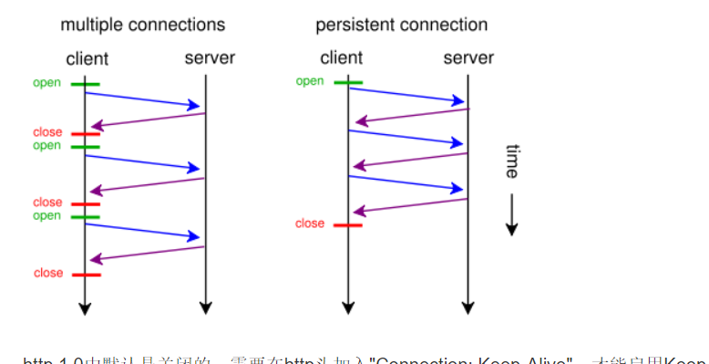
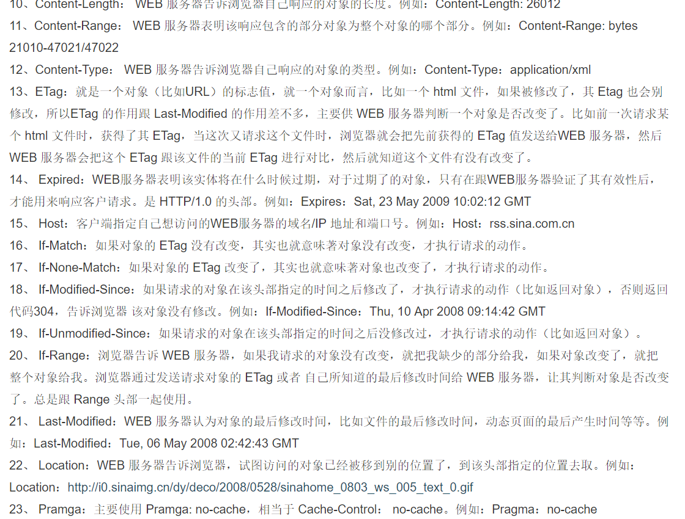

**1.keep-alive模式**

   我们知道http协议采用的是"请求-应答"模式，当使用普通模式非keep-alive，每个请求应答客户都要和服务器重新建立连接，挖成之后立即断开连接；当使用keep-alive模式，keep-Alive功能使客户端到服务器持续连接有效，提高效率
   
  
   http1.0默认是关闭的，需要在http头部加入”connection：keep-alive“才能开启，http1.1是默认开启的
   ![eeef55b825e7e24e745f86f05b9a3f45.png](evernotecid://FC302C00-19AD-48C5-874E-D1E6597E057C/appyinxiangcom/21681715/ENResource/p120
   
** 2.render页面的整个浏览器的流程**

   关联想象http协议
        W3C制定的标准  执行www标准  共有8个步骤
        
    步骤1.prompt for unload  浏览器已经打开一个页面了就把前一个页面内存清空。收拾残局
         操作1：navigationStart 浏览器上下文执行中如果有前一个页面有unload时间戳 就记下时间，如果没有就先空着 在线面fetchStart记录时间戳。
         操作2：redirectStart 重定向的开始
    步骤2.redirect 本地重定向
         操作1：redirectEnd 重定向结束。 

    处理缓存     
    步骤3. App cache 本地缓存 本地跳转如果有本地缓存就走这一步，如果没有本地缓存就直接跳过走DNS。发送http请求。
          操作1：FetchStart 如果没有unload时间戳，从此时记录时间戳。

    网络请求.
    步骤4. DNS dns域名解析服务器。把域名进行解析，把域名转化为IP.只发送域名部分进行解析。
         操作1. domainLookStart 开始时间
         操作2。 domainLookEnd 结束时间

    步骤5. tcp 到此步骤开始真正的和http服务器发生关系。http协议的底层是tcp协议。 三次握手。短连接的生命周期只到response。长连接就是keep-alive属性
         操作1 connectStart 开始连接
         操作2 安全层面的连接
         操作3 connectEnd 连接成功

    步骤6 request  request请求
         操作1 requestStart 请求开始
    两步之间是服务器的工作时间。
    步骤7 response  response服务器应答
           操作1 responseStart 意味着浏览器开始接受数据
           操作2 responseEnd   浏览器接受数据结束
   

    剩下的步骤是浏览器的渲染工作，网络层面结束。
    步骤8 processing
          操作1：domLoading  渲染dom树。渲染之前确保页面已经完全下载到本地。完整的html页面。
          操作2： domInteractive  完成解析dom树的时间。由html文本转化为DOM对象。
          操作3： domContentLoaded  dom解析完成后，页面的内部资源开始加载。
          操作4：domComplete dom处理完毕。

    步骤9 onload 在html中body挂载的onload事件。对html文档中所有的事件以及js全部方进入js当中。当前已经开始在浏览器上显示。
           操作1： loadEventSTART 事件处理开始
           操作2： loadEventEnd  事件处理完毕
  
    
**3.http请求头的含义**

   
   
**4.session cookie 在网络传输的意义**
   cookie session
      cookie是保存客户端的一小段文本
      session永远保存在服务器端，用唯一的sessionID来区分用户。 SessionID随每一个请求发送服务器，服务器根据id识别客户端
        因为http协议是一种无状态协议，不能区分客户端是谁，所以需要通过cookie和session判断客户
        客户端请求服务器，服务器签发身份证号码，然后客户端在请求时上送cookie客户端检查用户。
        客户端也是可以生成cookie，但是一般都是服务器签发给客户端的（set-Cookie,分条一个一个设置，客户端向服务器发送是一大串）。

   
   
   