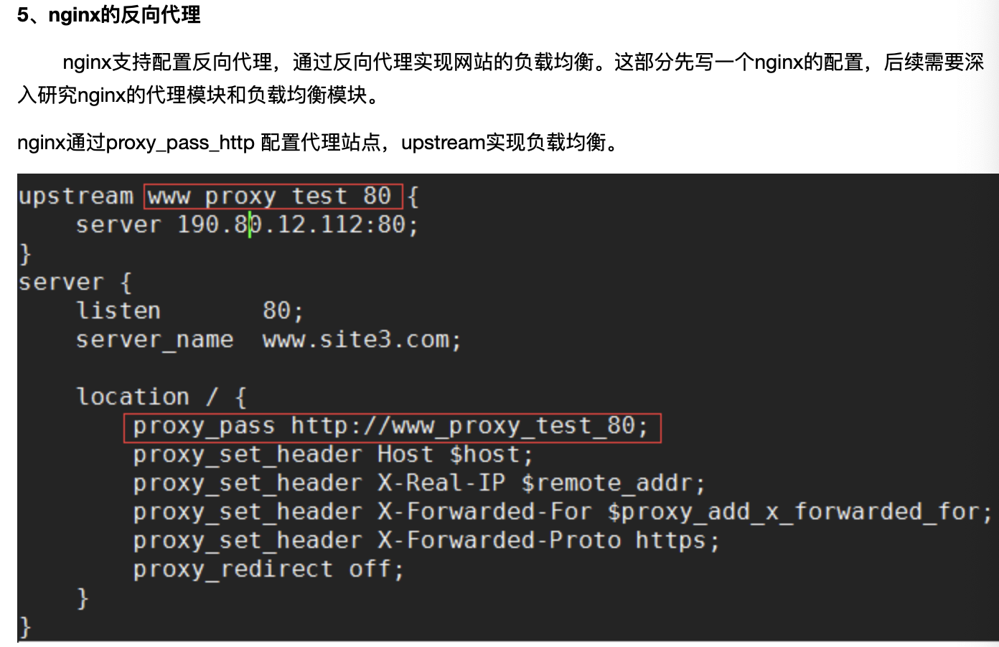
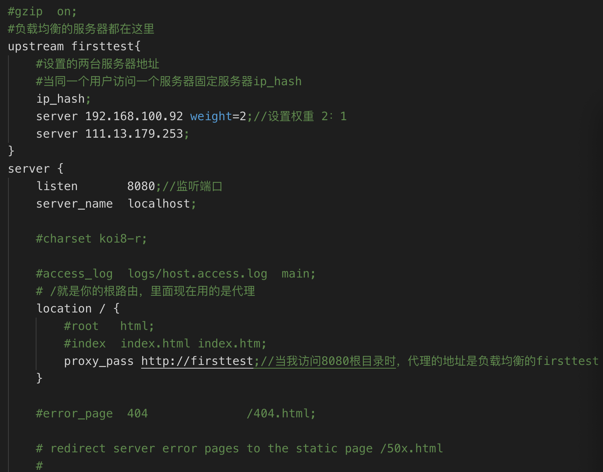

1.正向代理
  正向代理类似一个跳板机，代理访问外部资源，
  举个栗子：
  我是一个用户，我访问不了某网站，但是我能访问一个代理服务器，这个代理服务器呢,他能访问那个我不能访问的网站，于是我先连上代理服务器,告诉他我需要那个无法访问网站的内容，代理服务器去取回来,然后返回给我。从网站的角度，只在代理服务器来取内容的时候有一次记录，有时候并不知道是用户的请求，也隐藏了用户的资料，这取决于代理告不告诉网站。
  　总结来说：正向代理 是一个位于客户端和原始服务器(origin server)之间的服务器，为了从原始服务器取得内容，客户端向代理发送一个请求并指定目标(原始服务器)，然后代理向原始服务器转交请求并将获得的内容返回给客户端。客户端必须要进行一些特别的设置才能使用正向代理。
　　正向代理的用途：
　　（1）访问原来无法访问的资源，如google
   （2） 可以做缓存，加速访问资源
　　（3）对客户端访问授权，上网进行认证
　　（4）代理可以记录用户访问记录（上网行为管理），对外隐藏用户信息
  
  
2.反向代理
  反向代理（Reverse Proxy）实际运行方式是指以代理服务器来接受internet上的连接请求，然后将请求转发给内部网络上的服务器，并将从服务器上得到的结果返回给internet上请求连接的客户端，此时代理服务器对外就表现为一个服务器。
  反向代理的作用：
（1）保证内网的安全，可以使用反向代理提供WAF功能，阻止web攻击大型网站，通常将反向代理作为公网访问地址，Web服务器是内网。
（2）负载均衡，通过反向代理服务器来优化网站的负载

部署nodejs上线步骤：
    1.mac有神器  homebrew  包管理器  brew search nginx  brew install nginx
    2.brew info nginx 查看nginx版本信息查看nginx版本信息
    3.nginx -v 查看nginx信息
    4.启动 sudo brew services start nginx；（默认端口8080）//一般不用,直接nginx 直接运行。8080被占用
       4.1.nginx -s reload  nginx -s stop //nginx重新启动，nginx停止
    5.备注：如果你安装过jenkins这里会失效
      1.sudo launchctl unload/Library/LanunchDaemons/org.jenkins-ci.plist  jenkeins是顽固程序，以前安装先要杀掉进程
      2.systemctl start jenkins   开启jenkins进程    
    6.关闭sudo brew services stop nginx/nginx 
    8.打开nginx具体安装目录，查看配置文件 /usr/local/etc/nginx/;
       查看nginx.conf文件命令   cat nginx.conf
    9.验证配置文件 nginx -t -c 自己的配置文件地址
    10.拷贝配置文件至node项目目录 重新修改
    11.服务端的nginx地址
